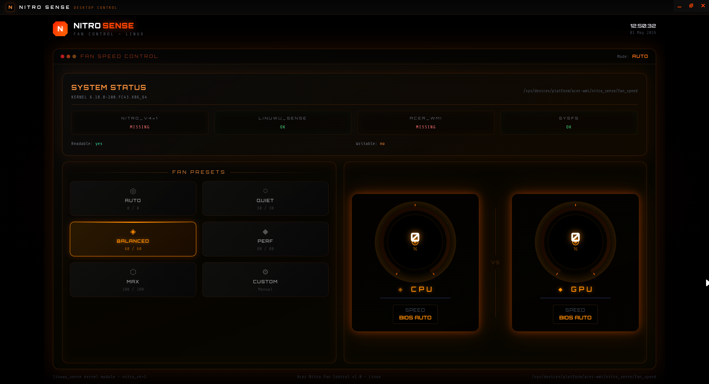

# 🔥 Nitro Control (Linux)

NitroSense-inspired fan control & monitoring app for Acer Nitro laptops on Linux.

A modern desktop application built with **Electron + React** that provides real-time fan visualization, presets, and a clean NitroSense-style UI.

---

## 🖼️ Preview



---

## 🚀 Features

- 🎛️ NitroSense-style dashboard UI
- 🌡️ Real-time CPU & GPU fan visualization
- ⚙️ Preset modes:
  - Auto
  - Quiet
  - Balanced
  - Performance
  - Max
  - Custom
- 🧠 Smart fallback (Demo mode if hardware not available)
- 🖥️ Desktop app (Electron-based)
- 🔥 Smooth animations (Framer Motion)

---

## 📦 Installation (Easy Way)
 
### ▶️ Run AppImage

1. Download from **Releases**
2. Make it executable:

```bash
chmod +x Nitro-Control-1.0.0.AppImage
---

Run:
 push     # 🔥 Nitro Control (Linux)

NitroSense-inspired fan control & monitoring app for Acer Nitro laptops on Linux.

A modern desktop application built with **Electron + React** that provides real-time fan visualization, presets, and a clean NitroSense-style UI.

---

## 🖼️ Preview


---

## 🚀 Features

* NitroSense-style dashboard UI
* Real-time CPU & GPU fan visualization
* Preset modes:

  * Auto
  * Quiet
  * Balanced
  * Performance
  * Max
  * Custom
* Demo mode fallback if hardware is not available
* Desktop app built using Electron
* Smooth animations using Framer Motion

---

## 📦 Installation (Easy Way)

### Run AppImage

1. Download the `.AppImage` from the **Releases** section
2. Make it executable:

chmod +x Nitro-Control-1.0.0.AppImage

3. Run:

./Nitro-Control-1.0.0.AppImage

---

## 🧑‍💻 Run from Source (Development)

git clone https://github.com/Pavan-dev0/Nitro-Sense-Linux.git
cd Nitro-Sense-Linux
npm install
npm run electron

---

## ⚙️ Requirements

This app depends on Linux kernel support.

### Required

* Acer Nitro laptop
* Linux (Fedora / Arch / Ubuntu)
* Kernel modules:

  * linuwu_sense
  * acer_wmi

### Recommended

Enable kernel flag:

nitro_v4=1

---

## ⚠️ Important Notes

* Fan control works only if your system exposes the Nitro EC interface
* If hardware is not available:
  → App automatically switches to Demo Mode
* Some systems may support reading fan speed but not writing

---

## 🧪 Tested System

* Laptop: Acer Nitro AN515-57
* CPU: Intel i5-11400H
* GPU: NVIDIA GTX 1650
* RAM: 8GB
* OS: Fedora Linux 43
* Kernel: 6.18.8
* Desktop: Hyprland (Wayland)

---

## 🔧 How It Works

* React + Tailwind → UI
* Electron → Desktop application
* Python bridge → Hardware interaction
* Uses sysfs + kernel modules for fan control

---

## 📁 Project Structure

Nitro_Sense/
├── App.jsx
├── ControlPanel.jsx
├── Gauge.jsx
├── StatusBar.jsx
├── main.js
├── preload.cjs
├── nitro-bridge.py
├── package.json

---

## ❗ Known Limitations

* Not all Nitro models are supported
* Requires kernel-level access
* Write control may require nitro_v4=1
* Wayland behavior may vary

---

## 🤝 Contributing

Contributions are welcome.

If your Nitro model works with this app, feel free to share your setup.

---

## 📜 License

MIT License

---

## 👨‍💻 Author

Pavan GM

---

## ⭐ Support

If this project helped you, consider giving it a star ⭐
